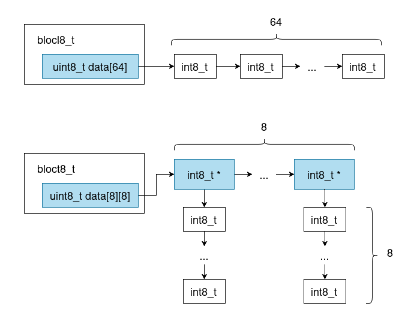
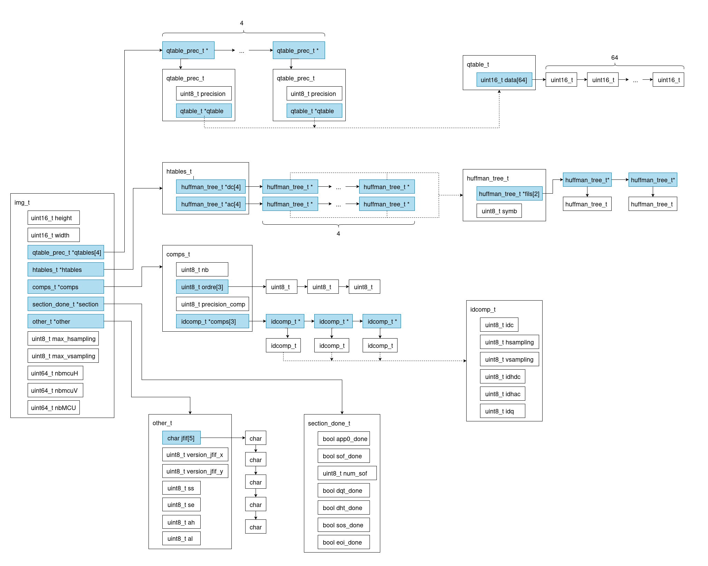
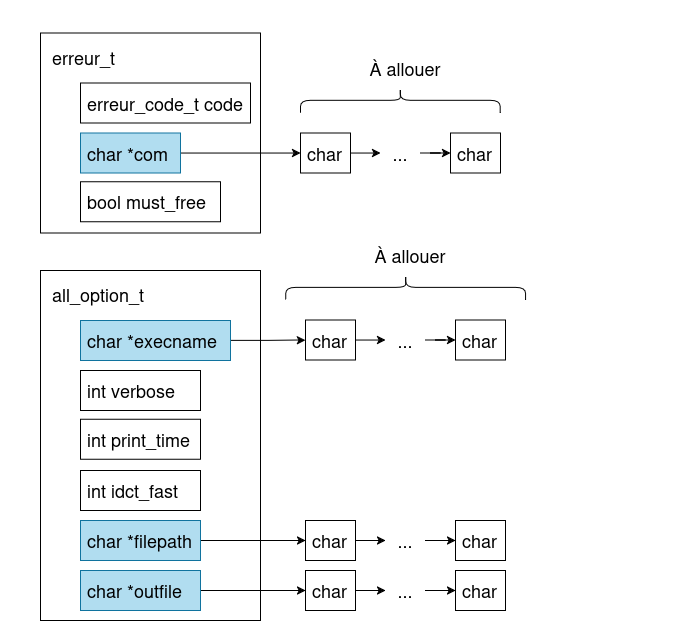

# Notre décodeur JPEG à nous

Bienvenue sur la page d'accueil de _votre_ projet JPEG, un grand espace de liberté, sous le regard bienveillant de vos enseignants préférés.
Le sujet sera disponible dès le lundi 5 mai à l'adresse suivante : [https://formationc.pages.ensimag.fr/projet/jpeg/jpeg/](https://formationc.pages.ensimag.fr/projet/jpeg/jpeg/).

Comme indiqué lors de l'amphi de présentation, vous devrez organiser un point d'étape avec vos enseignants pour valider cette architecture logicielle.
Cette page d'accueil servira de base à cette discussion. En pratique, vous pouvez reprendre son contenu comme bon vous semble, mais elle devra au moins comporter les infos suivantes :

1. des informations sur le découpage des fonctionnalités du projet en modules, en spécifiant les données en entrée et sortie de chaque étape ;
2. (au moins) un dessin des structures de données de votre projet (format libre, ça peut être une photo d'un dessin manuscrit par exemple) ;
3. une répartition des tâches au sein de votre équipe de développement, comportant une estimation du temps consacré à chacune d'elle (là encore, format libre, du truc cracra fait à la main, au joli Gantt chart).

Rajouter **régulièrement** des informations sur l'avancement de votre projet est aussi **une très bonne idée** (prendre 10 min tous les trois chaque matin pour résumer ce qui a été fait la veille, établir un plan d'action pour la journée qui commence et reporter tout ça ici, par exemple).

# Planning

**Planning prévisionnel :**  

| Version | Nom de code   | Caractéristiques                                         | Temps estimé |
|:-------:|:--------------|:---------------------------------------------------------|:-------------|
| 1       | Invader       | Décodeur d'images 8x8 en niveaux de gris                 | J+ 4         |
| 2       | Noir et blanc | Extension à des images grises comportant plusieurs blocs | J + 6        |
| 3       | Couleur       | Extension à des images en couleur                        | J+8          |
| 4       | Sous-ech      | Extension avec des images avec sous-échantionnage        | J +10        |

# Organisation

| Module   | Fonctionnalités                                                                                           | Répartition       |
|:--------:|-----------------------------------------------------------------------------------------------------------|-------------------|
| entete   | parse l'entête du fichier et remplit `img`, la structure contenant toutes les informations sur le fichier | Albin             |
| vld      |                                                                                                           | Gabriel           |
| iqzz     | inverse la quantification et transforme le vecteur 1x64 en un tableau 8x8                                 | Philippe          |
| idct     | passage du domaine spectral au domaine spatial avec la transformée en cosinus discrète inverse            | Philippe          |
| idct_op  | implémentation de l'idct rapide                                                                           | Philippe          |
| ycc2rgb  | transforme les composantes Y, $C_b$, $C_r$ en R, G, B                                                     | Gabriel           |
| jpeg2ppm | fonction principale contenant le main, appelant les autres modules                                        | Gabriel, Philippe |

**historique :**  
* création de `upsampler.c` puis intégration dans le main  
* séparation de `vld.c` en plusieurs modules (`vld.c`, `baseline.c`, `progressive.c`, `bitstream.c`)  
	

| Module  | Fonctions        | Entrées                                                                                                                                                                 | Sorties                                              |
|:-------:|------------------|-------------------------------------------------------------------------------------------------------------------------------------------------------------------------|------------------------------------------------------|
| entete  | decode_entete    | FILE *fichier   bool premier_passage   img_t *img                                                                                                                 | (img_t*) img                                         |
| vld     | decode_bloc_acdc | FILE *fichier   img_t *img   huffman_tree_t *hdc   huffman_tree_t *hac   blocl16_t *sortie   int16_t *dc_prec   uint8_t *off   uint16_t *skip_bloc | blocl16_t *sortie (tableau contenant le bloc décodé) |
| iqzz    | iquant           | blocl16_t *entree   uint8_t s_start   uint8_t s_end   qtable_t *qtable                                                                                         | blocl16_t *entree (déquantification en place)        |
| iqzz    | izz              | blocl16_t *entree                                                                                                                                                       | (bloct16_t *) bloc de sortie alloué dans iquant      |
| idct    | idct             | bloct16_t *bloc_freq   float stockage_coef[8][8][8][8]                                                                                                               | (bloctu8_t *) bloc de sortie alloué dans izz         |
| idct    | calc_coef        | float stockage_coef[8][8][8][8]                                                                                                                                         | float stockage_coef[8][8][8][8]                      |
| ycc2rgb | ycc2rgb_pixel    | uint8_t y   uint8_t cb   uint8_t cr   rgb_t *rgb                                                                                                               | rgb_t *rgb                                           |

## Schéma des structures utilisées

### Structures des blocs

On utilise plusieurs structures pour stocker en mémoire les blocs de l'image :  
  
Ces structure stockent des `uint8_t`, et il existe les mêmes structures mais stockant des `uint16_t`.  

Ce schéma représente l'implémentation de la structure de donnée contenant toutes les informations sur l'image à décoder, renseignée par `entete.c`.  
  

Ce schéma décrit quant à lui les structures utilisées pour la gestion des erreurs et des options en ligne de commande.  
  

  

  

* point le 15 mai:
TODO:
	gestion d'erreur
	refaire timer
	commenter le code
	finir les tests
	
# Droit dépôt git

Si vous avez besoin de droit supplémentaire sur votre dépôt git, venez voir les profs au premier étage du bâtiment E.

# Liens utiles

- Bien former ses messages de commits : [https://www.conventionalcommits.org/en/v1.0.0/](https://www.conventionalcommits.org/en/v1.0.0/) ;
- Problème relationnel au sein du groupe ? Contactez [Pascal](https://fr.wikipedia.org/wiki/Pascal,_le_grand_fr%C3%A8re) !
- Besoin de prendre l'air ? Le [Mont Rachais](https://fr.wikipedia.org/wiki/Mont_Rachais) est accessible à pieds depuis le bâtiment E !
- Un peu juste sur le projet à quelques heures de la deadline ? Le [Montrachet](https://www.vinatis.com/achat-vin-puligny-montrachet) peut faire passer l'envie à certains de vos profs de vous mettre une tôle !

